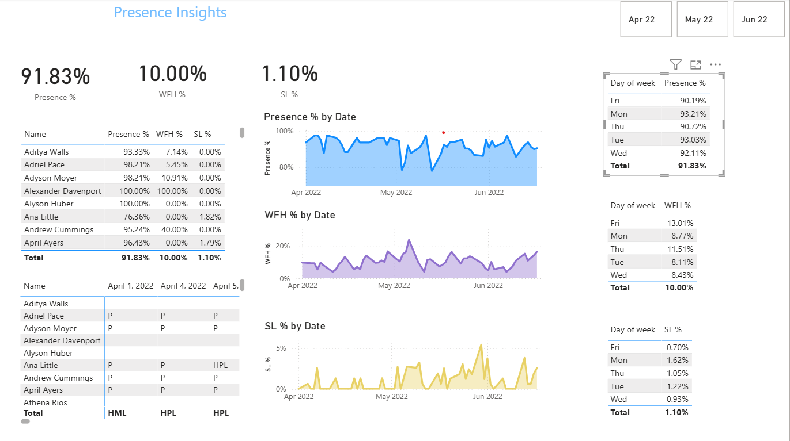

# AtliQ Technologies – Presence Insights Dashboard

## 📌 Project Overview

This Power BI dashboard analyzes employee attendance data from AtliQ Technologies over a 3-month period (April to June).  
It highlights employee presence, work-from-home (WFH) trends, and sick leave (SL) percentages across dates and weekdays.

## 🧠 Key Insights

- **Overall Presence**: 91.83% of scheduled workdays were attended.
- **Work From Home (WFH)**: 10% of working days were logged remotely.
- **Sick Leave (SL)**: 1.10% leave recorded across all employees.
- **Peak Attendance Days**: Mondays and Tuesdays showed the highest presence.
- **WFH Trends**: Fridays had the highest WFH percentage (13%).

## 🔧 Tools Used

- **Power BI** – Dashboard creation, data visualization, slicers
- **Excel** – Raw data storage and pre-cleaning
- **DAX** – Calculated columns and measures for KPIs and trends
- **Power Query** – Data transformation
